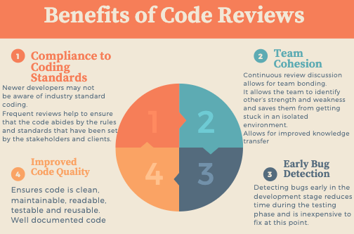

# What is code review? 

Code review is an activity part of the software quality assurance. This is where the source code is broken into small pieces an inspected by one or more team member(s) which is to be carried out just before testing. Code review is done in order to detect mistakes, catch early bugs and ensure that the code follows the standard practices. Implementing code reviews is one of the relatively cheapest ways to detect and reduce bugs at an early stage. 

## Objectives:

If the style of code is under compliance by all policies

If there is any breach of security and most importantly 

If the code can be understood easily or not

## Benefits of Code Review

[Diagram created using canva.com](https://www.canva.com/)

## Best Practices

### Do's and Don'ts

- #### Know what you're looking for, Don’t make simple errors:  

    Create a checklist of things that’s important to look out for, such as the design, structure, readability, the complexity and functionality. Doing so eliminates simple errors and provides clarity to other team members for what is expected for each review type. Focus on items that need human intervention and which aren't highlighted during automated testing such as deign and functionality.  

-  #### Give feedback that is helpful not hurtful: 

    Be constructive not critical. Be considerate of the developer and offer valuable feedback in a respectful manner. Rather than making bold statements ask questions politely. Encouragement is essential, this should inspire them to improve and minimize mistakes in the future. Create a safe environment where reviewing code is seen as a learning process.  
 

- #### Include all team members, don’t isolate to yourself:  

    Regardless developer experience, all code must be reviewed. Developers will produce the highest quality work once they know their code is being review by a fellow team member. Including a software engineer and architect whilst reviewing helps different issues to be detected.  Including multiple people in the code review in turn improves collaboration and relationships between developers. 
 

### Resources: 

https://www.lambdatest.com/blog/how-code-reviewing-can-help-with-quality-assurance/

https://dzone.com/articles/how-code-reviewing-can-help-with-quality-assurance

