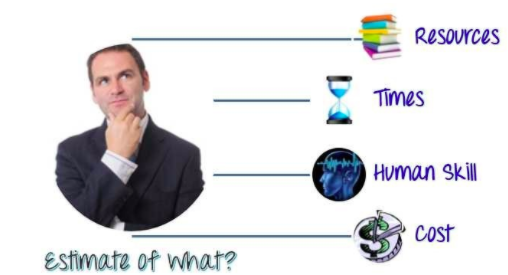
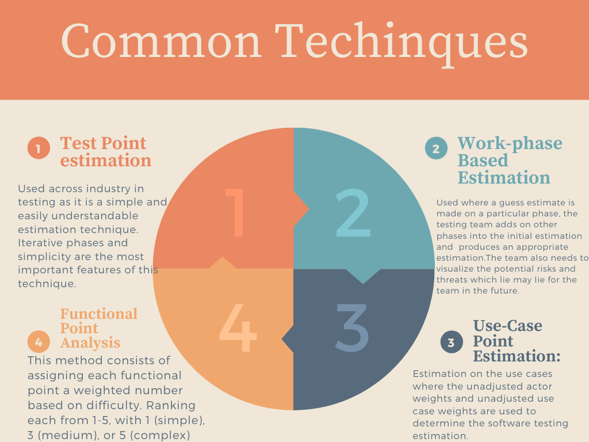
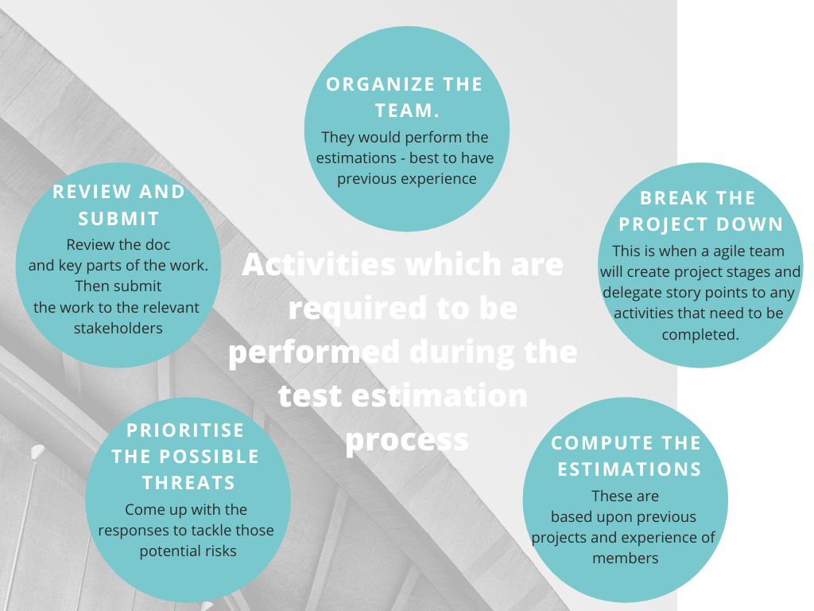
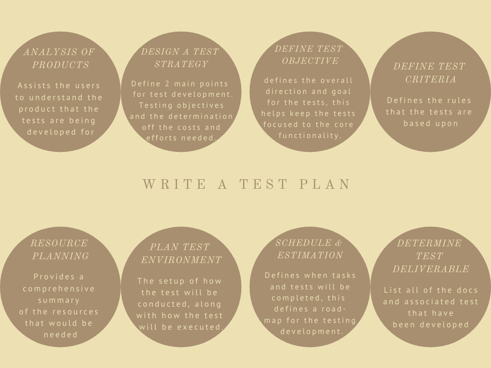

# Task Estimation 

**_Task Estimation_** is the process of estimating and predicting the total effort that’s required to complete a task and to get it to a stage where the product is ready to be deliver to the Customer. Estimations are based on assumptions and imperfect knowledge. The objective of task estimation is to get an estimate of the time, money and number of people required to finish the defined task. 

## Steps Involved

  In an Agile environment, the Epic would be broken into User Stories which would then be estimated into story points and the put into the sprint backlog meetings. After this the team will take stories from the backlog and assign them respectively in the given sprint. It is important to ensure that these stories do not exceed the estimated sprint velocity. 
   
## What to Estimate

 What to Estimate: | Explanation: 
-------------- | -------------
Resources:  |  Projects need resources in order to complete the given task. Such as, equipment, funding or anything that you need in order to complete the task defined.
Time:  | Every task works towards a deadline. Factors including frontend/ backend difficulty, human skills, deployment difficulty and requirement specification should be considered in order to reduce and factor time in for the unknowns when trying to accurately estimate the time for a task.
Cost:    | Projects Budget - The financial commitment necessary for completing a project successfully, after taking all factors into account. 
Human Resources:    | Factors such as the knowledge and developer experience of team members, is crucial to take into consideration.

## Task Estimation Techniques 

**_Planning techniques_** are essential for Test Estimation. A template pattern can be used to guarantee requirements and other aspects of the project are met. 

 
 

## The Basic Prerequisites Of The Test Estimation Process

**_Test Estimation_** is the process of finding an estimate, or approximate value, usable for some purpose even if input data may be incomplete or uncertain. 

 
**1) Insights gathered from past experience:** It is good practice to spend some time recalling past projects with comparable challenges to the current project you are working on. 

**2) The available documents or artifacts:** The test management repository tools are very helpful, these documents define the scope of the project. 

**3) Assumptions about the type of work:** Having previous experience with similar projects helps make predictions about the project, hiring experienced professionals is important. 
 

**4) Calculation of potential risks:** The testing team also needs to prepare for potential risks which may arise in the future. This follows on from making assumptions about the type of work you are doing. 

**5) Determining whether the documents have been baselined:** The team also needs to make a decision if the requirements for the project have been baselined. If the documents are not baselined then it is crucial to determine the frequency of the changes. 

**6) All responsibilities and dependencies should be clear:** The organization should clearly define the roles and responsibilities for everyone who would be performing the estimation process. 

**7) Documentation and tracking of the estimation records:** All the relevant information to the estimation process should be documented. 
 

**8) Activities which are required to be performed during the test estimation process:** 

# Testing Tasks
**_Testing Tasks_**  
Firstly involves research of the project, members through and analyse the project documentation. Allowing the team to get a good overview of the project and discuss and resolve and questions or problems that may arise. After, we can the move on into the flow of testing, this is done in various ways to ensure that there is an adherent flow to the development and logic surrounding the tests that are being written.

**1) Write a test Plan**

**2) Conducting and evaluating tests**

When conducting test suites, the data that you use to test is as important as the test itself, depending on the data inputted into a test it may change the expected behaviour of the test. It is important to make sure that the test are ran in isolation and as a suit, this will make sure that the tests written are comprehensive and cover different types of behaviors of the application.
    
**3) Building Test Case**

Important to be clear and concise throughout. Include all steps and relevant data to carry out the test are in the spec. The expected result from the test should be defined in the case, as this may help other users understand the logic of the test and identify unexpected behavior. Assumptions and preconceptions should be included also, as this will help to assist new users when establishing any preconditions required for the test. 

**4) Develop an escalation procedure**

A large portion of escalation procedure is identifying the severity of a problem. When we do this, prevention measures become simpler. This can be done by creating an outline of behaviour on certain errors and assigning a risk level to them. This helps identify bugs, allowing the developers understand the severity of the bug. 

**5) Verify fixes**

Once fixes have been made, a root cause analysis must be performed. This analysis will identify the cause of the bug and may assist the development team in reducing the chance of a similar bug arising. When the bug is fixed, a risk analysis must be conducted, this helps the development team identify the risk if the bug occurs again. Finally, make sure that all other test suits are ran before releasing the fix, this will ensure that the fix doesnt affect other features of the app.

## Resources
- https://www.softwaretestinghelp.com/agile-estimation-techniques/ 
- https://www.softwaretestinghelp.com/software-test-estimation-how-to-estimate-testing-time-accurately/
- https://www.guru99.com/an-expert-view-on-test-estimation.html 
- https://fortegrp.com/how-to-estimate-testing-time/
- https://medium.com/globalluxsoft/time-estimation-in-software-development-a4a495c8eb6c